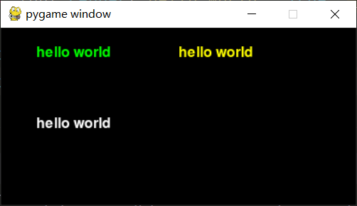
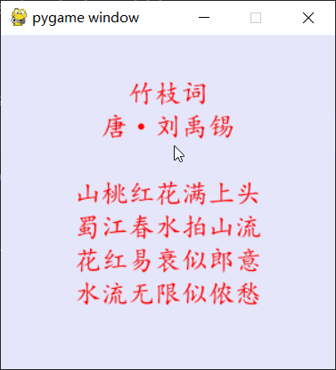

## 第一节 基础知识

> 本节掌握要点： 文本, 图形, 键鼠事件，动态展示。

### 一、实现基础窗口
#### 0 - 新建文件
新建`001.py`文件，内容如下
```
import pygame

pygame.init() # pygame 初始化，必须有，且必须在开头

# 创建主窗体, (400,200)会将窗体长设置为400，高设置为200
win = pygame.display.set_mode((400,200))
```
> 我这里将窗体命名为`win`，是`window`(窗口)的缩写。
在很多教程中，窗体也常被命名为`screen`。

此时运行`001.py`,会发现一个一闪而逝的小窗口，

进一步，我们自然而然的就要思考这些问题
#### 1 怎么维持住这个窗口?
**通过while循环去实现**

即在最后新加两行
```python
while True:
    pass
```

#### 2 如何刷新
简单的循环只是单纯的将界面卡住，怎么实现刷新？
**在循环体内使用`pygame.display.update()`语句进行界面的更新**

即将`while`循环改为
```python
while True:
    pygame.display.update()
```

#### 3 刷新频率限制

- *循环的刷新频率不做节制的话，界面会飞速刷新导致卡死，怎么办？*
**pygame有专门的对象`pygame.time.Clock`用于去控制循环刷新的频率，
创建`pygame.time.Clock`对象后，
调用该对象的`tick()`方法,函数参数为每秒刷新次数,
就可以设置循环每秒刷新频率，术语叫做帧率(FPS)**
>  可前往官方文档观看pygame.time.Clock的更多细节，https://www.pygame.org/docs/ref/time.html#pygame.time.Clock

即将`while`循环改为
```python
# 用于控制循环刷新频率的对象
clock = pygame.time.Clock()

while True:
    clock.tick(60)  # 控制循环刷新频率,每秒刷新60次
    pygame.display.update()
```

#### 4 基础窗口
上面全部完成后，`001.py`整体如下
```
import pygame

pygame.init() # pygame初始化，必须有，且必须在开头

# 创建主窗体, (400,200)会将窗体长设置为400，高设置为200
win = pygame.display.set_mode((400,200))

# 用于控制循环刷新频率的对象
clock = pygame.time.Clock()

while True:
    clock.tick(60)  # 控制循环刷新频率,每秒刷新60次
    pygame.display.update()
```
此时运行`001.py`, 就可以得到一个最最最基础的窗口了。
效果如下


> 此时窗口还有一个问题，就是关闭按钮不灵敏，很容易卡死。
这个问题我们后面键鼠事件部分再处理。
现阶段先用pycharm的运行中的终止按钮结束窗口。
运行中的终止按钮：运行程序时，左下角的红色方块，鼠标悬停上面会看到`stop ...`文本提示。
这种方法关闭会导致控制台窗口有报错，先不管它。

### 二、展示文本

#### 1 展示基础文本

绘制文本常要三步
1. 创建字体对象
2. 用字体对象，创建文本对象
3. 将文本对象，放在窗口的某个位置

复制第一部分的代码文件，命名为`002a.py`，
在`while`循环之前，添加如下三行代码，即可展示文本。

```python
# 新建字体对象，SysFont的第一个参数是字体名，设置为None会使用默认字体，
# 第二个参数是字体大小（尺寸size）
font = pygame.font.SysFont(None, 24)
# 用刚新建的字体对象，创建文本对象，
# render的第一个参数是文本(字符串类型），
# 第二个参数为是否设置光滑边缘，一般设置为True就好
# 第三个参数为文本颜色
text = font.render('hello world', True, "green")
# 将文本展示在指定位置，blit的第一个参数是文本对象，
# 第二个参数是坐标（左上角的横坐标，纵坐标）
win.blit(text, (40, 20))
```

此时运行效果如下


**颜色值**
`render`的第三个参数为颜色值
pygame的颜色值有多种写法，非常灵活，
这里使用字符串，这里罗列些常用的颜色名
（完整的有非常多，这里只列出了些简单好记得）
```python
[
    # 红，橙，黄，绿，蓝，青，紫
    "red", "orange", "yellow", "green", "blue", "cyan", "purple",
    # 黑，灰，白
    "black", "gray", "white"
]
```

#### 2 坐标
`blit`的第二个参数是坐标，
要绘制的对象的左上角，的横坐标与纵坐标, 即(x, y)。
pygame界面是以整个窗体的左上角顶点为原点，
以水平向右方向为x轴正方向，以竖直向下为y轴正方向。

这里拓展下上面的例子，多绘制几个文本，展示在不同的位置，来感受下对应的效果。
在上一段代码之后(`while`循环之前)添加如下代码
```python
text2 = font.render('hello world', True, "yellow")
text3 = font.render('hello world', True, "white")

win.blit(text2, (200, 20))
win.blit(text3, (40, 100))
```

此时运行效果如下


坐标示意图如下


此时完整代码`002.py`如下(去掉了注释)
```python
import pygame

pygame.init()
win = pygame.display.set_mode((400,200))
clock = pygame.time.Clock()

font = pygame.font.SysFont(None, 24)
text = font.render('hello world', True, "green")
win.blit(text, (40, 20))

text2 = font.render('hello world', True, "yellow")
text3 = font.render('hello world', True, "white")

win.blit(text2, (200, 20))
win.blit(text3, (40, 100))

while True:
    clock.tick(60)
    pygame.display.update()
```

#### 3 课堂练习
如何展示多行文本，
比如展示如下的诗歌

```txt
I've saved the summer
And I give it all to you
To hold on winter mornings
When the snow is new

I've saved some sunlight
If you should ever need
A place away from darkness
Where your mind can feed
```

> 这首诗**I've saved the summer**，是人教版高中英语选修6，
> 第二单元 Poems 里面的一篇诗歌（应该是第16页）。
> 课文里总共有五段，这里节选了开头两段。
> 该诗原作者是 Rod McKuen
> 参考： [高二英语选修六电子课本](http://www.dzkbw.com/books/rjb/yingyu/xgxx6/)

绘制后效果如下


两段之间有一个额外的分隔（思考这个分隔如何处理）。

这里使用了`"Arial"`字体。（一般电脑都会有该字体）
如果没有就用之前的默认字体吧。

#### 4 提示
> 编程的思维：化繁为简。
> 遇到重复的操作，思考如何简化。

一行一行固定写位置非常的麻烦，
使用循环更加简洁高效。

。
。
。
。
。
。

具体来讲，就是多行文本放入列表中，循环从列表中取文本，同时计算其位置。

。
。
。
。
。
。

两段之间的分隔如何更智能的处理？
如果写两个循环，其实麻烦了，
逻辑上也有种不连续，被中断的感觉。

。
。
。
。
。
。

多的那个分隔，理解为空行，用一个空字符串去占领一行

。
。
。
。
。
。


#### 5 参考答案
新建文件`002b.py`如下

```python
import pygame

pygame.init()
win = pygame.display.set_mode((350,350))
clock = pygame.time.Clock()

lines = [
    "I've saved the summer",
    "And I give it all to you",
    "To hold on winter mornings",
    "When the snow is new",
    "",
    "I've saved some sunlight",
    "If you should ever need",
    "A place away from darkness",
    "Where your mind can feed",
]

font = pygame.font.SysFont("Arial", 24)
# 起始的横纵坐标
sx = 50  # 开头是对齐的，所以每行的横坐标都是这个
sy = 40  # 纵向是一行一行的，每行的纵坐标都要在这个基础上做计算
for i in range(len(lines)):  # 遍历索引，以知道是哪一行
    line = lines[i]  # 通过索引取到对用的行
    text = font.render(line, True, "white")
    yi = sy + i * 30  # 计算对应的纵坐标，索引即行号，30是行高
    win.blit(text, (sx, yi))

while True:
    clock.tick(60)
    pygame.display.update()
```


### 三、键鼠事件
#### 1 解决卡顿问题
一般来讲，重新实现这个窗口关闭功能，就不会卡顿了。
这个功能需要先在开头导入`sys`，即开头添加如下代码
```python
import sys
```

再在循环体内（开头部分）添加如下代码。

```python
# 获取所有事件
for event in pygame.event.get():
    if event.type == pygame.QUIT:
        # 判断当前事件是否为点击右上角退出键
        pygame.quit()
        sys.exit() # 需要提前 import sys
```

此时界面就不会有那种特别卡顿的问题了，
同时界面右上角的关闭按钮可以正常工作了。

点击左上角按钮会产生事件event， 其类型为`pygame.QUIT`。

#### 2 键盘按键事件
按下键盘也会产生事件event，其类型为`pygame.KEYDOWN`

在刚才的`if`后面新加一个`if`判断是否为按键事件，
是则打印出`event`。

这里复制之前的`002a.py`文件，重命名为`003a.py`。
修改后其`while`循环如下
```python
while True:
    for event in pygame.event.get():
        if event.type == pygame.QUIT:
            # 判断当前事件是否为点击右上角退出键
            pygame.quit()
            sys.exit()  # 需要提前 import sys

        if event.type == pygame.KEYDOWN:
            print(event)

    clock.tick(60)
    pygame.display.update()
```

此时按下`a`,`s`,`d`，左方向键，右方向键，控制台输出如下
```txt
<Event(768-KeyDown {'unicode': 'a', 'key': 97, 'mod': 4096, 'scancode': 4, 'window': None})>
<Event(768-KeyDown {'unicode': 's', 'key': 115, 'mod': 4096, 'scancode': 22, 'window': None})>
<Event(768-KeyDown {'unicode': 'd', 'key': 100, 'mod': 4096, 'scancode': 7, 'window': None})>
<Event(768-KeyDown {'unicode': '', 'key': 1073741904, 'mod': 4096, 'scancode': 80, 'window': None})>
<Event(768-KeyDown {'unicode': '', 'key': 1073741903, 'mod': 4096, 'scancode': 79, 'window': None})>
```

其中看到每个event都有`unicode`， `key`, `mod`, `scancode`, `window`这些属性。
前两个比较重要，后面的暂时不用管。
- `unicode`: 按键文本，即对应字母。
  功能键没有文本（所以是空字符串）
- `key`: 按键的编号（id）的效果，其值比较复杂，不用去记，
有简单办法来处理，未来需要了会展开讲。

#### 3 打字与显示
这里我们可以将按键的文本展示出来
将原本的文本`"hello world"`绘制删除，
再将`print`输出改为绘制按键输入的文本。

修改完后`003a.py`如下

```python
import pygame
import sys

pygame.init()
win = pygame.display.set_mode((400,200))
clock = pygame.time.Clock()

font = pygame.font.SysFont(None, 24)

while True:
    for event in pygame.event.get():
        if event.type == pygame.QUIT:
            # 判断当前事件是否为点击右上角退出键
            pygame.quit()
            sys.exit()  # 需要提前 import sys

        if event.type == pygame.KEYDOWN:
            text = font.render(event.unicode, True, "green")
            win.blit(text, (40, 20))

    clock.tick(60)
    pygame.display.update()
```
此时按下字母，窗体上会展示新字母。

此时会有一个新问题出现，那就是继续按键，字母会重叠绘制，导致看不清。

#### 4 刷新背景
如果我们希望相同位置的内容不会覆盖，那么就要清理掉之前绘制的内容。

而这往往需要实现背景的刷新。
pygame的背景刷新，是通过在每轮循环开头重新绘制背景完成的。
每次绘制会覆盖掉之前绘制的内容，所以内容可能需要重新绘制。

设置背景的代码非常简单,
对窗体对象使用`fill`方法即可，
其接收一个参数，为背景颜色值。
```python
win.fill("black")
```
不过需要注意的是，这段代码放在不同的位置会产生不同的效果。
放在while循环之前，代表只绘制一次背景，会被后面绘制的东西遮住。
放在while循环中，则是每一帧都会绘制一次背景，每一帧都会清理掉上一帧的内容，一般用于去覆盖掉那些希望删掉的元素。

我们这里放的位置也很讲究，需要放在按键判断中的开头。
即`if event.type == pygame.KEYDOWN:`之后，添加后该判断变为如下
```python
if event.type == pygame.KEYDOWN:
    win.fill("black")

    text = font.render(event.unicode, True, "green")
    win.blit(text, (40, 20))
```
此时就可以按一个字母，展示一个字母了。


> 如果我们放在整个`while`循环的开头，按键的字母只会出现一瞬间，因为按一次`if`判断只会通过一次，从而只会展示一帧，下一帧就覆盖刷新了。

#### 5 打单词练习
上面的例子中，打一个字母展示一个字母，之前的字母消失掉了。
现在希望打过的字母都能一起显示，
比如在键盘上连续打击`"w`, `"o"`, `"r"`, `"d"`.
能在屏幕上看到`word`（如下图）.
且每多敲一个字母按键屏幕上就能多展示一个字母


这个练习非常简单，所以就不做提示了。
（**不要把这个问题想复杂了**）

。
。
。
。
。
。

#### 6 参考答案
思路说明：
1. 新建一个字符串变量，比如说命名为`word`
2. 每按一个字母按键，将字母添加到字符串`word`中
3. 刷新屏幕，展示字符串`word`

代码`003b.py`如下
```python
import pygame
import sys

pygame.init()
win = pygame.display.set_mode((400,200))
clock = pygame.time.Clock()

font = pygame.font.SysFont(None, 24)
# 1. 新建一个字符串变量
word = ""

while True:
    for event in pygame.event.get():
        if event.type == pygame.QUIT:
            pygame.quit()
            sys.exit()

        if event.type == pygame.KEYDOWN:
            # 2. 每按一个字母按键，将字母添加到字符串`word`中
            word += event.unicode
            # 3. 刷新屏幕，展示字符串`word`
            win.fill("black")
            text = font.render(word, True, "green")
            win.blit(text, (40, 20))

    clock.tick(60)
    pygame.display.update()
```

> 有的同学可能会想把单词里面的字母一个一个绘制。
> 那样就把这个问题搞得太复杂了，没必要。
> 不是说实现不了，只是实现起来要额外花太多功夫，
> 讲起来也不好讲。

### 四、绘制图块
> 除了文本的展示，最常见的就是各种图形的绘制了
> 其实文本和图形，展示起来都算作绘制，有些语法有相通之处。

#### 1 基础图块绘制
- 绘制矩形

```python
# 新建矩形
rect1 = pygame.Rect(100, 20, 200, 60)
# 绘制矩形
pygame.draw.rect(win, "red", rect1)
```
其中`Rect(left, top, width, height)`接受四个参数，
分别是左上顶点的横坐标，纵坐标，矩形的宽度，矩形的高度。
也可以写成`Rect((left, top), (width, height))`的形式。

`pygame.draw.rect(surface, color, rect)`接收三个参数时
第一个参数指定要绘制在哪个界面上
第二个参数指定绘制的颜色
第三个参数为矩形对象。

- 绘制圆形
```python
# 绘制圆形
pygame.draw.circle(win, "blue", (100, 150), 50)
```
`pygame.draw.circle(surface, color, center, radius)`接收四个参数时
前两个参数意义和`pygame.draw.rect`的一样，
第三个参数指定圆心的坐标（横纵坐标组成的二元组）
第四个参数指定圆的半径

- 绘制三角形
`pygame`没有专门绘制三角形的，但是有绘制多边形的，
这里我们将三角形当作三个顶点的多边形来处理即可。
```python
# 三个顶点的横纵坐标
points = [
    (300, 100),
    (250, 200),
    (350, 200),
]
# 用三个顶点去绘制多边形，即可得到三角形
pygame.draw.polygon(win, "green", points)
```
`pygame.draw.polygon(surface, color, points)`
第三个参数指定多边形的顶点坐标，
其格式一般为一个列表，列表中的每一项为多边形的一个顶点坐标，
有几个顶点，绘制出来就是几边形。

- 绘制线段
```python
# 指定起点与终点的坐标
start = (100, 240)
end = (300, 240)
# 根据起点与终点坐标绘制线段
pygame.draw.line(win, "white", start, end)
```
`pygame.draw.line(surface, color, start_pos, end_pos)`
第三个参数为起点坐标，第四个参数为终点坐标

- 完整代码
此时完整代码`004a.py`如下

```python
import pygame
import sys

pygame.init()
win = pygame.display.set_mode((400,300))
clock = pygame.time.Clock()

# 新建矩形
rect1 = pygame.Rect(100, 20, 200, 60)
# 绘制矩形
pygame.draw.rect(win, "yellow", rect1)

# 绘制圆形
pygame.draw.circle(win, "blue", (100, 150), 50)

# 三个顶点的横纵坐标
points = [
    (300, 100),
    (250, 200),
    (350, 200),
]
# 用三个顶点去绘制多边形，即可得到三角形
pygame.draw.polygon(win, "green", points)

# 指定起点与终点的坐标
start = (100, 240)
end = (300, 240)
# 根据起点与终点坐标绘制线段
pygame.draw.line(win, "white", start, end)

while True:
    for event in pygame.event.get():
        if event.type == pygame.QUIT:
            pygame.quit()
            sys.exit()

    clock.tick(60)
    pygame.display.update()
```

绘制效果如下


坐标说明示意图如下


- 指定宽度
上面的四个绘制函数
`pygame.draw.rect(surface, color, rect)`
`pygame.draw.circle(surface, color, center, radius)`
`pygame.draw.polygon(surface, color, points)`
`pygame.draw.line(surface, color, start_pos, end_pos)`
还可以指定拓展参数`width`，
指定后形状会变成边框，即不再有填充。

在之前的代码中，每个绘制函数括号里的最后面，添加`, width=5`
则绘制效果如下。


#### 2 绘制练习
使用上面学到的知识绘制如下图形


这里背景使用了`"lavender"`(薰衣草)颜色。

颜色尺寸其实都可以自由发挥，主要是练习下坐标的计算。


#### 3 提示

以左上角为圆心，水平向右为x轴正方向
竖直向下为y轴正方向，建立平面直角坐标系计算坐标。

。
。
。
。
。
。

#### 4 参考答案

坐标计算示意图如下


代码`004b.py`如下
```python
import pygame
import sys

pygame.init()
win = pygame.display.set_mode((400,350))
clock = pygame.time.Clock()

win.fill("lavender")

# 绘制屋顶
points = [
    (200, 50),
    (60, 150),
    (340, 150),
]
pygame.draw.polygon(win, "black", points)

# 绘制房子主体（大矩形）
rect1 = pygame.Rect(100, 150, 200, 150)
pygame.draw.rect(win, "black", rect1, width=5)

# 绘制门（小矩形）
rect2 = pygame.Rect(180, 220, 40, 80)
pygame.draw.rect(win, "black", rect2)

# 绘制窗户
pygame.draw.circle(win, "black", (140, 200), 30, width=5)
pygame.draw.circle(win, "black", (260, 200), 30, width=5)

# 绘制地平线
start = (0, 300)
end = (400, 300)
pygame.draw.line(win, "black", start, end, width=5)

while True:
    for event in pygame.event.get():
        if event.type == pygame.QUIT:
            pygame.quit()
            sys.exit()

    clock.tick(60)
    pygame.display.update()
```

### 五、鼠标事件

#### 1 基础介绍
鼠标事件event有三种类型（使用时前面要加`pygame.`)
- MOUSEMOTION: 鼠标移动
- MOUSEBUTTONUP: 鼠标（按下后）松开(弹起)
- MOUSEBUTTONDOWN: 鼠标按下

这三种类型的事件，常用的属性有：
- pos: 鼠标的位置，具体为横纵坐标构成的二元组

只有后两者有的属性
(MOUSEBUTTONUP和MOUSEBUTTONDOWN有，MOUSEMOTION 没有)
- button: 对应的按键。
  MOUSEMOTION，鼠标移动，没法对应到单个按键。

这么讲还是有点抽象，难理解，我们上例子

#### 2 鼠标点击
这里做一个鼠标点击，控制台展示鼠标坐标的小例子。
界面上看是纯黑的，不会显示或绘制其他东西。

```python
import pygame
import sys

pygame.init()
win = pygame.display.set_mode((400,300))
clock = pygame.time.Clock()

while True:
    for event in pygame.event.get():
        if event.type == pygame.QUIT:
            pygame.quit()
            sys.exit()

        if event.type == pygame.MOUSEBUTTONDOWN:
            print(event.pos)

    clock.tick(60)
    pygame.display.update()
```
此时点鼠标左键（其实点右键也一样），会看到控制台输出一个二元组数据（点一下会输出一个），这个二元组就是点击时鼠标所在位置。

我点击了三下，控制台输出效果如下
```txt
(165, 141)
(61, 98)
(261, 125)
```

其实里面的新代码就两行
```python
if event.type == pygame.MOUSEBUTTONDOWN:
    print(event.pos)
```

#### 3 方格练习
在界面中绘制一个小方格（大小随意，不要占满界面就行）
判断鼠标是否落在方格中
方格下放一个文本，
鼠标在方格中，文本显示`"in"`
鼠标不在方格中，文本显示`"out"`

参考效果如下图


> 这个练习难度比之前的都要高，
> 也可以当作课后练习来做哈

#### 4 思路分析
1. 绘制一个矩形
2. 循环中，判断事件类型如果为`MOUSEBUTTONDOWN`，则计算坐标是否在矩形中
3. 刷新界面（重置背景），绘制矩形与文本

#### 5 参考答案
代码`005b.py`如下
```python
import pygame
import sys

pygame.init()
win = pygame.display.set_mode((400,300))
clock = pygame.time.Clock()

# 画矩形
left, top, width, height = 100, 50, 200, 100
rect1 = pygame.Rect(left, top, width, height)
# 建立字体
font = pygame.font.SysFont(None, 24)
# 建立显示对应的文本字符串
info = "out"

while True:
    # 刷新界面（重置背景）
    win.fill("black")
    pygame.draw.rect(win, "yellow", rect1)
    for event in pygame.event.get():
        if event.type == pygame.QUIT:
            pygame.quit()
            sys.exit()

        # 判断事件类型
        if event.type == pygame.MOUSEMOTION:
            px, py = event.pos
            # 判断坐标是否在矩形中
            if left <= px <= left + width and top <= py <= top + height:
                info = "in"
            else:
                info = "out"

    # 绘制文本与矩形
    text = font.render(info, True, "green")
    win.blit(text, (150, 200))

    clock.tick(60)
    pygame.display.update()
```

### 六、课后练习
#### 1 逐行展示
上面的小练习中我们展示了一首英文诗歌。

那么这里我们再做一个中文诗歌的文本展示，
但是诗文是一行一行，逐步展示的。
（鼠标点击一下，展示出下一行）

诗文如下：
```txt
竹枝词
唐·刘禹锡

山桃红花满上头，
蜀江春水拍山流。
花红易衰似郎意，
水流无限似侬愁。
```

展示完毕效果如下



这里字体用的是楷体`"kaiti"`
背景颜色用了之前的薰衣草色`"lavender"`
文本颜色用的红色`"red"`
窗口长宽都为300，字体尺寸为24。
这些也可以根据自己需要灵活调整。

> 中间有个分隔行，不用做特殊处理，可以多点一两次。
> 中文展示需要对应的字体支持，如果尝试发现自己电脑上字体不支持，
> 那么可以用之前的那首英文诗歌。
> 这里为了效果好看，设计为居中对齐的，居中对齐是有一点复杂的，
> 下面有关于居中对齐的提示
> 觉得看不懂或者麻烦就可以不管，做成和之前的英文诗歌的左对齐也行。

居中对齐的提示
对于字体`render`渲染出来的文本对象，
可以使用`get_size()`方法获得该文本的长度和高度
```python
text = font.render(line, True, "red")
text_width, text_height = text.get_size()
```
思考如何计算，以完成居中对齐

#### 2 方格点击计数
实现一个点击计数功能，由于之前的第五部分已经实现过一个方格练习，
这里只是实现单个方格就过于简单了，
所以加大了点难度，实现三个方格的点击计数。

即如下图


绘制三个方格，我这里选了紫色绿色黄色
下方文本记录方格被点击次数（这里不用管鼠标左右键，都算），
图中，紫色方块被点击了5次，绿色方块被点击了12次，黄色方块被点击了0次。

1. 如果觉得三个方块有点复杂，可以先实现一个的，然后再拓展成三个的

2. 进阶思考（**困难**）：思考如何实现能写成循环的，以方便拓展方格个数，比如拓展成5个或者7个甚至9个。
（实现后，只需修改极少代码，即可展示更多）

建议在已经实现基础版本之后，再尝试进阶思考。

> 更多颜色
[https://www.pygame.org/docs/ref/color_list.html](https://www.pygame.org/docs/ref/color_list.html)
