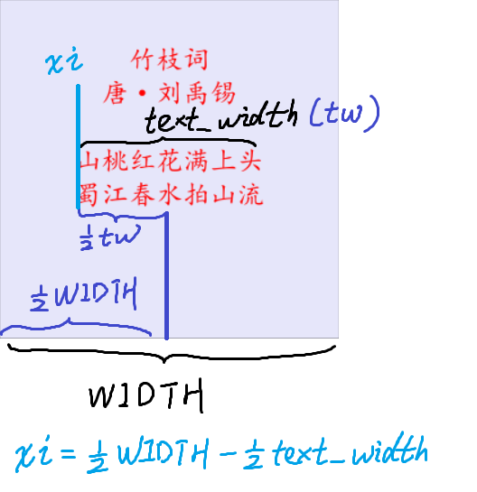
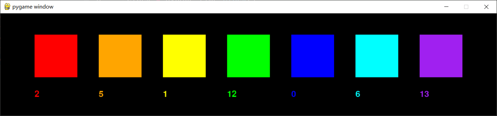
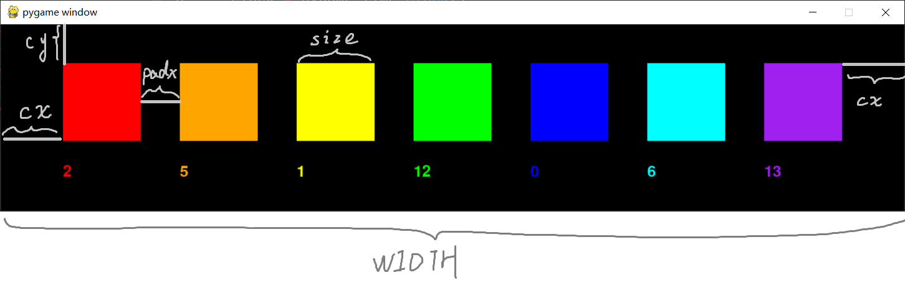

## 第一节 基础知识 练习提示与答案
### 1 逐行展示
#### 思路提示
1. 点击触发

之前的多行展示，是通过循环实现的。
这一回要点击触发一行的展示，不能直接使用循环了。
这里我们往更深层次去思考一下：
之前循环的本质是一个不断增长的i，
所以我们这里可以实现一个随按键点击不断增长的i，
i增长后再使用差不多的循环体语句即可。

2. 居中对齐

纵坐标计算和之前差不多，
也是设置一个初始的`sy`，
之后每次`yi`可由
sy + i * 行高 计算得出

关键是横坐标的计算
其计算示意图如下



整个窗口宽度为`WIDTH`
文本框宽度为`text_width`
文本框居中对齐的话，
文本框左边的横坐标`xi`计算公式如下
$$
xi = \frac 1 2 WIDTH - \frac 1 2 text\_width
$$

---

没
有
意
义
的
分
隔
段
落

#### 参考答案

代码`006a.py`如下

```python
import pygame
import sys

WIDTH, HEIGHT = 300, 300

pygame.init()
win = pygame.display.set_mode((WIDTH, HEIGHT))
clock = pygame.time.Clock()

lines = [
    "竹枝词",
    "唐·刘禹锡",
    "",
    "山桃红花满上头",
    "蜀江春水拍山流",
    "花红易衰似郎意",
    "水流无限似侬愁"
]

font = pygame.font.SysFont("kaiti", 24)
sy = 40
i = 0

win.fill("lavender")

while True:
    for event in pygame.event.get():
        if event.type == pygame.QUIT:
            pygame.quit()
            sys.exit()

        if event.type == pygame.MOUSEBUTTONDOWN:
            if i < len(lines):
                line = lines[i]  # 通过索引取到对用的行
                text = font.render(line, True, "red")
                text_width, text_height = text.get_size()
                yi = sy + i * 30  # 计算对应的纵坐标，索引即行号，30是行高
                xi = WIDTH // 2 - text_width // 2
                win.blit(text, (xi, yi))
                i += 1

    clock.tick(60)
    pygame.display.update()
```

### 2 方格点击计数
#### 思路提示
需要一个变量去记录点击次数，
方块每被点击一次，变量+1，

坐标数值，有关联的，尽量用变量去记录与计算。（方便修改与拓展）

三个方块可以一个一个计算，一个一个展示与判断

---

没
有
意
义
的
分
隔
段
落

#### 参考答案
`006b.py`如下

```python
import pygame
import sys

pygame.init()
win = pygame.display.set_mode((500,240))
clock = pygame.time.Clock()


# 用变量去记录数据，方便动态的计算，防止全部写数字混乱，且不好辨识与理解意义
size = 100

x1, x2, x3 = 50, 200, 350
y = 50
rect1 = pygame.Rect(x1, y, size, size)
rect2 = pygame.Rect(x2, y, size, size)
rect3 = pygame.Rect(x3, y, size, size)

c1 = 0
c2 = 0
c3 = 0
font = pygame.font.SysFont(None, 30)

while True:
    win.fill("black")

    pygame.draw.rect(win, "purple", rect1)
    pygame.draw.rect(win, "green", rect2)
    pygame.draw.rect(win, "yellow", rect3)
    t1 = font.render(str(c1), True, "purple")
    t2 = font.render(str(c2), True, "green")
    t3 = font.render(str(c3), True, "yellow")

    win.blit(t1, (x1, y + size + 30))
    win.blit(t2, (x2, y + size + 30))
    win.blit(t3, (x3, y + size + 30))

    for event in pygame.event.get():
        if event.type == pygame.QUIT:
            # 判断当前事件是否为点击右上角退出键
            pygame.quit()
            sys.exit()  # 需要提前 import sys

        if event.type == pygame.MOUSEBUTTONDOWN:
            px, py = event.pos
            if x1 <= px < x1 + size and y <= py <= y +size:
                c1  += 1

            if x2 <= px < x2 + size and y <= py <= y + size:
                c2 += 1

            if x3 <= px < x3 + size and y <= py <= y +size:
                c3  += 1

    clock.tick(60)
    pygame.display.update()
```

### 3 方格点击计数 进阶
多个方格
实现效果预览




#### 思路提醒
> 建议在阅读完2的参考答案之后，再尝试这个

1. 多个方格的点击次数，可以存放在列表容器中

2. 颜色直接提供7个，想更多可以自己添加
```python
COLORS = ["red", "orange", "yellow", "green", "blue", "cyan", "purple"]
```

3. 这里关键就是循环的使用，与坐标的计算。
  循环中，计算第i个方格的位置，绘制第i个方格及其对应文本。

4. 对于鼠标是否点击在方格中，使用循环进行计算与判断。

---

没
有
意
义
的
分
隔
段
落

#### 进一步提示



最左边的方格的左上角，坐标为 $(cx, cy)$
左右间距要对齐，所以最右边方格右侧的间隔长也为 $cx$
方格彼此之间的间距为 $padx$
方格尺寸为 $size$
方格个数为 $NUM$

窗体总长度为$WIDTH$

数学关系有
$$
WIDTH = cx + NUM \times size + padx \times (NUM - 1) + cx
$$

第$i$个方格的左边横坐标为
$$
xi = cx + i \times (size + padx)
$$

文本的纵坐标为$cy + size + 30$
这里30可以灵活调整。

#### 参考答案
> 下方变量名大小写可能对于初学者有点乱，这个地方其实也没有特别严格的标准（或者说我也没掌握到家）。
> 一般变量名能小写尽量小写。
> 适用大写的情景主要有（TODO）：常量（尤其是存放固定数据的容器，或者很重要的控制整个程序情况的量），顶层窗口尺寸。
> 如果不理解就全部小写。


`006c.py`如下
```python
import pygame
import sys

# 红橙黄绿蓝青紫
COLORS = ["red", "orange", "yellow", "green", "blue", "cyan", "purple"]
NUM = 7

size = 100
padx = 50 # 方格间的水平间距
cx, cy = 80, 50

WIDTH = cx + NUM * size + padx * (NUM-1) + cx

pygame.init()
win = pygame.display.set_mode((WIDTH,240))
clock = pygame.time.Clock()

# 把点击数也放到专门的列表中
counts = []
for i in range(NUM):
    counts.append(0)

font = pygame.font.SysFont(None, 30)

while True:
    win.fill("black")

    # 使用循环，计算各个矩形和文本的位置，并进行绘制
    for i in range(NUM):
        color = COLORS[i]
        xi = cx + i * (size + padx)
        rect = pygame.Rect(xi, cy, size, size)
        pygame.draw.rect(win, color, rect)
        text = font.render(str(counts[i]), True, color)

        win.blit(text, (xi, cy + size + 30))

    for event in pygame.event.get():
        if event.type == pygame.QUIT:
            pygame.quit()
            sys.exit()

        if event.type == pygame.MOUSEBUTTONDOWN:
            px, py = event.pos
            for i in range(NUM):
                xi = cx + i * (size + padx)
                if xi <= px < xi + size and cy <= py <= cy +size:
                    counts[i] += 1

    clock.tick(60)
    pygame.display.update()
```
